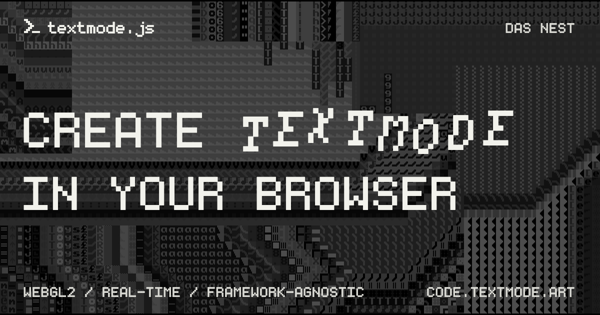

# textmode.js

|    |   |   |
|:---|:---|:---|

textmode.js is a free, lightweight, and framework-agnostic creative-coding library for real‑time ASCII and textmode graphics in the browser. It combines a grid‑based API with a modern [`WebGL2`](https://developer.mozilla.org/en-US/docs/Web/API/WebGL2RenderingContext) pipeline, multiple render targets, and aggressive instanced rendering to deliver smooth, high‑performance rendering.

The library is designed to be easy to use and accessible to developers of all skill levels. Whether you're a seasoned developer or just starting out, `textmode.js` provides a simple and intuitive API that makes it easy to create stunning textmode art and animations.

## Features

- **Real-time creative drawing** - Grid-based WebGL2 rendering for characters, colors, text, glyph ramps, and 2D/3D primitives
- **Fonts and tilesets** - Runtime TTF/OTF/WOFF loading, bitmap tilesets, dynamic sizing, and reusable glyph atlases
- **Layers and compositing** - Independent grids, fonts, transforms, visibility, opacity, and blend modes per layer
- **Media conversion** - Images, videos, and live textures converted into configurable glyph and color data
- **Programmable GLSL rendering** - Push beyond the drawing API with custom [`GLSL ES 3.00`](https://registry.khronos.org/OpenGL/specs/es/3.0/GLSL_ES_Specification_3.00.pdf) materials, user-defined uniforms, textures, and offscreen framebuffers
- **Animation and generative tools** - Loop and timing controls, deterministic randomness, noise, vectors, math, and easing
- **Interaction and responsive rendering** - Built-in mouse, keyboard, touch, gamepad, resize, and HiDPI support
- **Plugins and framework integration** - Typed lifecycle hooks and layer/source extension points

> [!NOTE]
> *Performance depends on the complexity of your scene and device capabilities.

## Try it online first

Open [editor.textmode.art](https://editor.textmode.art/), a browser-based live-coding environment for the
complete official `textmode.js` ecosystem. Sketches run as you edit, with no local toolchain required.

The editor includes `textmode.js` and all four official add-ons: `textmode.export.js`, `textmode.filters.js`,
`textmode.figlet.js`, and `textmode.synth.js`.

- Write with Monaco-powered completions, hover documentation, and diagnostics.
- Start with a blank sketch, an included example, or a community gallery sketch.
- Keep code and preferences saved in the browser, then share sketches through URL-based links.
- Use microphone or line-input analysis for audio-reactive work, and create on desktop or mobile.

Use it to create and iterate on core sketches, then combine add-ons as your project grows.

## Installation

Follow the [official installation guide](https://code.textmode.art/docs/installation) to install `textmode.js`
with npm or a browser-ready UMD bundle and to add official plugins.

## Next steps

- **[Read the documentation](https://code.textmode.art/)** for core concepts, guides, and installation details.
- **[Browse the API reference](https://code.textmode.art/api/textmode.js/)** for the complete typed API.
- **[Explore the examples](./examples/)** to see common drawing, animation, media, and plugin patterns.
- **[Try the live editor](https://editor.textmode.art/)** to sketch interactively in the browser.

## Contributing

Thank you for considering contributing to this project! (✿◠‿◠)

Please read the [Contributing Guide](./CONTRIBUTING.md) to get started.

<!-- TEXTMODE-CONTRIBUTORS:START -->
<!-- prettier-ignore-start -->
<!-- Generated from https://github.com/humanbydefinition/code.textmode.art/blob/main/.vitepress/data/contributors.json and https://github.com/humanbydefinition/code.textmode.art/blob/main/.vitepress/data/contribution-types.json. Do not edit this section directly. -->
## Contributors

Thanks to the people who contribute code, documentation, design, examples, ideas, infrastructure, and care
across the textmode.js ecosystem.

<!-- markdownlint-disable MD033 -->
<table>
  <tbody>
    <tr>
      <td align="center" valign="top" width="14.28%">
        <a href="https://github.com/humanbydefinition">
          
           <b>humanbydefinition</b>
        </a>
         💻 📖 🎨 💡 🤔 🚧 🚇 🔧 🔌 👀
      </td>
      <td align="center" valign="top" width="14.28%">
        <a href="https://github.com/trintlermint">
          
           <b>trintlermint</b>
        </a>
         🎨 💡
      </td>
    </tr>
  </tbody>
</table>
<!-- markdownlint-enable MD033 -->

Contribution details and profile links are maintained on the [textmode.js contributors page](https://code.textmode.art/docs/contributors).
<!-- prettier-ignore-end -->
<!-- TEXTMODE-CONTRIBUTORS:END -->

## License

`textmode.js` is licensed under the [MIT License](./LICENSE).

## Acknowledgements

- **[Typr.js](https://github.com/photopea/Typr.js)**
  - Custom-made TypeScript rewrite and minified subset by [Photopea](https://github.com/photopea), used for font loading and parsing.
  - License: [MIT License](https://github.com/photopea/Typr.js/blob/gh-pages/LICENSE).

- **[UrsaFont](https://ursafrank.itch.io/ursafont)**
  - Default bundled font created by [UrsaFrank](https://ursafrank.itch.io/).
  - License: [CC0 (Creative Commons Zero)](https://creativecommons.org/publicdomain/zero/1.0/).
